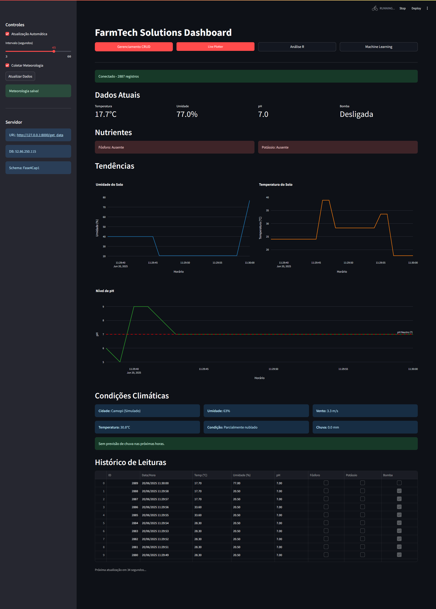
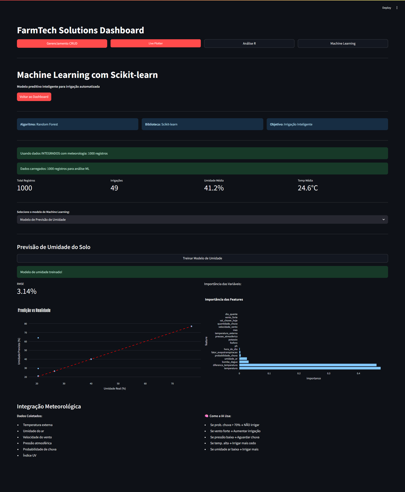
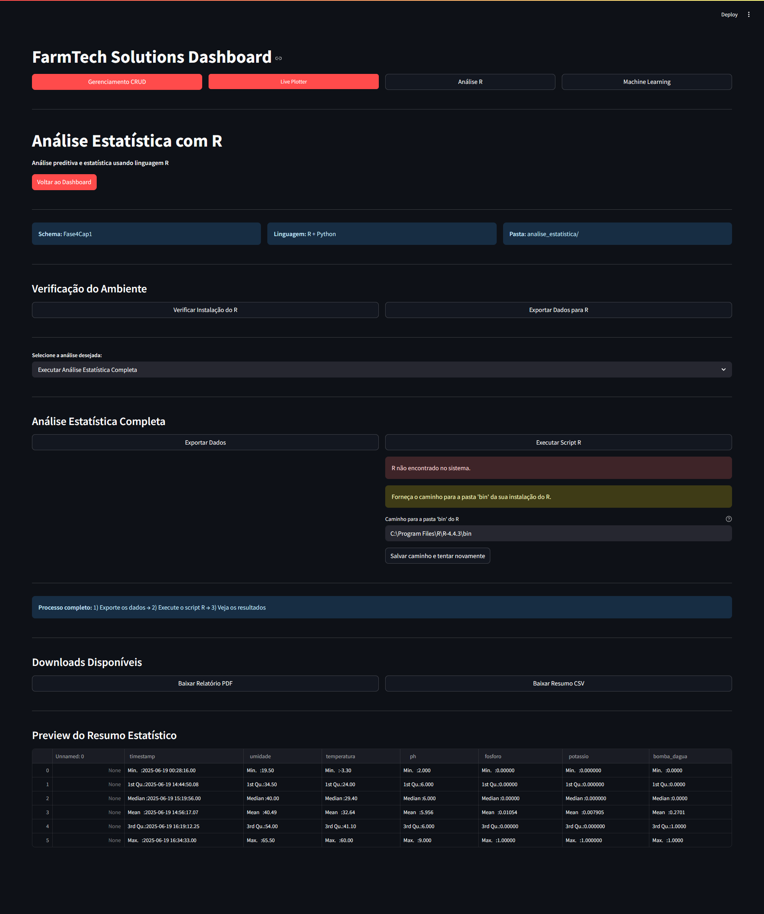
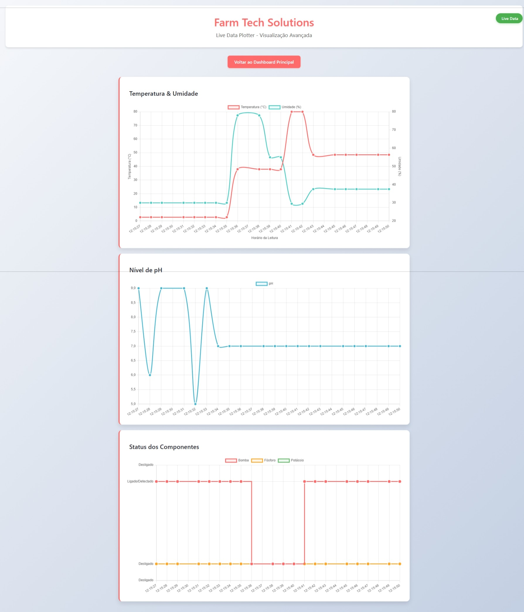

# FarmTech Solutions - Fase 4
## Sistema Inteligente de Irrigação Automatizada com IA e IoT

<p align="center">
  
</p>

### **Grupo 56 - Turma: 2TDSPS**

| Nome | RM |
|------|-----|
| Felipe Sabino da Silva | RM558616 |
| Juan Felipe Voltolini | RM557538 |
| Luiz Henrique Ribeiro de Oliveira | RM558447 |
| Marco Aurélio Eberhardt Assumpção | RM558375 |
| Paulo Henrique Senise | RM557712 |

### **Professores:**
- **Tutor:** Leonardo Ruiz Orabona
- **Coordenador:** André Godoi

---

## **Índice**
- [Sobre o Projeto](#-sobre-o-projeto)
- [Arquitetura do Sistema](#-arquitetura-do-sistema)
- [Tecnologias Utilizadas](#-tecnologias-utilizadas)
- [Funcionalidades](#-funcionalidades)
- [Requisitos Fase 4](#-requisitos-fase-4)
- [Instalação e Configuração](#-instalação-e-configuração)
- [Como Usar](#-como-usar)
- [Estrutura do Projeto](#-estrutura-do-projeto)
- [Demonstração](#-demonstração)
- [Vídeo](#-vídeo)

---

## **Sobre o Projeto**

A **FarmTech Solutions** é um sistema avançado de irrigação automatizada que combina IoT, Inteligência Artificial e análise de dados para otimizar o cultivo agrícola. Este projeto evolui da Fase 3, incorporando:

- **Machine Learning** com Scikit-learn para previsões inteligentes
- **Dashboard Interativo** com Streamlit
- **Análise Estatística** com R
- **Banco de Dados** PostgreSQL robusto
- **Monitoramento em Tempo Real** com ESP32

### **Objetivo Principal**
Desenvolver um sistema completo que utilize dados de sensores IoT para tomar decisões inteligentes sobre irrigação, maximizando a eficiência hídrica e otimizando o crescimento das plantas.

---

## **Arquitetura do Sistema**


### **Arquitetura do Banco de Dados - 3 Tabelas Inteligentes**

O sistema utiliza uma arquitetura híbrida com **3 tabelas especializadas** que trabalham em conjunto para fornecer dados otimizados para diferentes propósitos:

#### **Tabela 1: `leituras_sensores`** (Dados Puros do ESP32)
```sql
-- Função: Armazenar dados básicos dos sensores IoT
CREATE TABLE leituras_sensores (
    id SERIAL PRIMARY KEY,
    data_hora_leitura TIMESTAMP NOT NULL,
    criacaots TIMESTAMP DEFAULT NOW(),
    umidade DECIMAL(5,2),           -- Umidade do solo (%)
    temperatura DECIMAL(5,2),       -- Temperatura do solo (°C)
    ph DECIMAL(4,2),               -- pH do solo
    fosforo BOOLEAN,               -- Presença de fósforo
    potassio BOOLEAN,              -- Presença de potássio
    bomba_dagua BOOLEAN            -- Status da bomba (ON/OFF)
);
```
**Uso:** Histórico limpo e puro dos sensores, backup confiável, consultas específicas de hardware.

#### **Tabela 2: `dados_meteorologicos`** (Dados Climáticos Integrados)
```sql
-- Função: Dados meteorológicos usando MESMA LÓGICA do dashboard
CREATE TABLE dados_meteorologicos (
    id SERIAL PRIMARY KEY,
    data_hora_coleta TIMESTAMP DEFAULT NOW(),
    temperatura_externa DECIMAL(5,2),    -- Temperatura do ar (°C)
    umidade_ar DECIMAL(5,2),             -- Umidade relativa do ar (%)
    pressao_atmosferica DECIMAL(8,2),    -- Pressão atmosférica (hPa)
    velocidade_vento DECIMAL(5,2),       -- Velocidade do vento (km/h)
    direcao_vento VARCHAR(10),           -- Direção do vento (N, S, E, W, etc.)
    condicao_clima VARCHAR(50),          -- Condição climática
    probabilidade_chuva DECIMAL(5,2),    -- Probabilidade de chuva (%)
    quantidade_chuva DECIMAL(5,2),       -- Quantidade de chuva (mm)
    indice_uv DECIMAL(4,2),             -- Índice UV
    visibilidade DECIMAL(5,1),          -- Visibilidade (km)
    cidade VARCHAR(100) DEFAULT 'Camopi',
    fonte_dados VARCHAR(50) DEFAULT 'Sistema Unificado Dashboard+API'
);
```
**Uso:** Usa a **mesma lógica meteorológica** do dashboard "Condições Climáticas", garantindo consistência total entre os sistemas.

#### **Tabela 3: `leituras_integradas`** (Dados Completos para ML)
```sql
-- Função: Dados combinados + fatores calculados para Machine Learning
CREATE TABLE leituras_integradas (
    id SERIAL PRIMARY KEY,
    data_hora_leitura TIMESTAMP DEFAULT NOW(),
    
    -- Dados dos sensores IoT
    umidade_solo DECIMAL(5,2),
    temperatura_solo DECIMAL(5,2),
    ph_solo DECIMAL(4,2),
    fosforo BOOLEAN,
    potassio BOOLEAN,
    bomba_dagua BOOLEAN,
    
    -- Dados meteorológicos
    temperatura_externa DECIMAL(5,2),
    umidade_ar DECIMAL(5,2),
    pressao_atmosferica DECIMAL(8,2),
    velocidade_vento DECIMAL(5,2),
    condicao_clima VARCHAR(50),
    probabilidade_chuva DECIMAL(5,2),
    quantidade_chuva DECIMAL(5,2),
    
    -- FATORES CALCULADOS AUTOMATICAMENTE
    diferenca_temperatura DECIMAL(5,2),   -- temp_externa - temp_solo
    deficit_umidade DECIMAL(5,2),         -- umidade_ar - umidade_solo
    fator_evapotranspiracao DECIMAL(5,2)  -- Calculado por fórmula científica
);
```
**Uso:** Machine Learning, IA, decisões inteligentes, análise completa.

### **Processo Automático de Integração (5 Passos)**

Quando o ESP32 envia dados, o sistema executa automaticamente:

```
ESP32 → /data → Servidor Flask executa:

1. PASSO 1: Salva dados básicos em `leituras_sensores`
2. PASSO 2: Coleta dados meteorológicos (MESMA LÓGICA do dashboard)
3. PASSO 3: Salva dados climáticos em `dados_meteorologicos`
4. PASSO 4: Calcula fatores derivados:
   • diferenca_temperatura = temp_externa - temp_solo
   • deficit_umidade = umidade_ar - umidade_solo  
   • fator_evapotranspiracao = fórmula científica baseada em temp + vento + umidade
5. PASSO 5: Cria entrada completa em `leituras_integradas`

RESULTADO: 23 features prontas para Machine Learning!
GARANTIA: Dados meteorológicos consistentes entre Dashboard e API!
```

### **View ML Otimizada: `view_ml_completa`**

```sql
-- View com 23 features para Machine Learning
CREATE VIEW view_ml_completa AS
SELECT 
    -- Dados básicos
    umidade_solo, temperatura_solo, ph_solo, fosforo, potassio, bomba_dagua,
    
    -- Dados meteorológicos
    temperatura_externa, umidade_ar, pressao_atmosferica, velocidade_vento,
    probabilidade_chuva, quantidade_chuva,
    
    -- Fatores calculados
    diferenca_temperatura, deficit_umidade, fator_evapotranspiracao,
    
    -- Variáveis temporais
    EXTRACT(HOUR FROM data_hora_leitura) as hora_do_dia,
    EXTRACT(DOW FROM data_hora_leitura) as dia_semana,
    EXTRACT(MONTH FROM data_hora_leitura) as mes,
    
    -- FLAGS INTELIGENTES (calculadas automaticamente)
    CASE WHEN probabilidade_chuva > 70 THEN 1 ELSE 0 END as vai_chover_hoje,
    CASE WHEN velocidade_vento > 15 THEN 1 ELSE 0 END as vento_forte,
    CASE WHEN temperatura_externa > 30 THEN 1 ELSE 0 END as dia_quente
    
FROM leituras_integradas;
```

### **Vantagens da Arquitetura com 3 Tabelas**

**Separação de Responsabilidades** - Cada tabela tem função específica  
**Flexibilidade de Consultas** - Pode consultar dados específicos ou completos  
**Manutenção Fácil** - Problemas meteorológicos não afetam dados dos sensores  
**Performance Otimizada** - Consultas específicas são mais rápidas  
**Dados ML Prontos** - Tabela integrada com 23 features otimizadas  
**Escalabilidade** - Fácil adicionar novas fontes de dados  
**Garantia Temporal** - Dados sincronizados no mesmo timestamp  
**Automação Total** - ESP32 só envia sensores, meteorologia é automática  

### **Exemplo de Decisão Inteligente**

**Cenário:** Dia quente e ventoso
```
Dados coletados automaticamente:
- Temperatura externa: 35°C | Temperatura solo: 22°C  
- Umidade ar: 30% | Umidade solo: 60%
- Vento: 18 km/h | Probabilidade chuva: 15%

Fatores calculados automaticamente:
- diferenca_temperatura: +13°C (solo mais frio que ar)
- deficit_umidade: -30% (ar muito seco comparado ao solo)
- fator_evapotranspiracao: 8.4 (alta evaporação esperada)

Flags inteligentes:
- vai_chover_hoje: 0 (não vai chover)
- vento_forte: 1 (vento acima de 15 km/h)
- dia_quente: 1 (temperatura acima de 30°C)

Decisão do sistema:
⚠ALERTA: Alta evaporação esperada (fator 8.4)
RECOMENDAÇÃO: Irrigar preventivamente
TIMING: Irrigar de manhã cedo para minimizar perdas
ECONOMIA: Não esperar chuva (probabilidade apenas 15%)
```

---

## **Tecnologias Utilizadas**

### **Frontend & Interface**
- **Streamlit** - Dashboard interativo e responsivo
- **Plotly** - Visualizações interativas e gráficos
- **HTML/CSS/JavaScript** - Live Plotter personalizado

### **Backend & Dados**
- **Flask** - API REST para comunicação ESP32
- **PostgreSQL** - Banco de dados principal
- **Pandas** - Manipulação e análise de dados

### **Inteligência Artificial**
- **Scikit-learn** - Machine Learning e modelos preditivos
- **R** - Análise estatística avançada e previsões ARIMA
- **NumPy** - Computação científica

### **IoT & Hardware**
- **ESP32** - Microcontrolador principal
- **Wokwi** - Simulação de hardware
- **Sensores:** Umidade, Temperatura, pH, Nutrientes

### **DevOps & Ferramentas**
- **Git/GitHub** - Controle de versão
- **Python 3.9+** - Linguagem principal
- **R 4.3+** - Ambiente estatístico

---

## **Funcionalidades**

### **Dashboard Principal**
- Visualização em tempo real dos dados dos sensores
- Gráficos interativos de tendências
- Alertas climáticos e recomendações
- Auto-refresh configurável (45 segundos)
- Interface responsiva e moderna

### **Gerenciamento CRUD**
- **Inserir** novas leituras de sensores
- **Listar** e gerenciar registros existentes
- **Atualizar** dados históricos
- **Remover** registros desnecessários
- **Estatísticas** detalhadas dos dados
- **Consultas** filtradas por umidade

### **Live Plotter**
- Gráficos em tempo real com Chart.js
- Visualização avançada de múltiplas variáveis
- Interface integrada com design consistente
- Monitoramento contínuo de sensores

### **Machine Learning (Scikit-learn)**
- **Modelo de Previsão de Irrigação** (Random Forest Classifier)
- **Modelo de Previsão de Umidade** (Random Forest Regressor)
- **Sistema Inteligente Completo** com recomendações
- **Análise de Importância** das variáveis
- Métricas de performance (Acurácia, RMSE)

### **Análise Estatística (R)**
- Estatísticas descritivas detalhadas
- Correlações entre variáveis
- Visualizações com ggplot2
- **Previsões ARIMA** para próximas 24 leituras
- Análise de séries temporais

---

## **Requisitos Fase 4**

### **Incorporar Scikit-learn** 
- Modelo Random Forest para previsão de irrigação
- Modelo de regressão para previsão de umidade
- Sistema inteligente com recomendações automáticas
- Análise de importância das features
- Métricas de avaliação (Acurácia, RMSE)

### **Implementar Streamlit** 
- Dashboard interativo completo
- Visualizações em tempo real
- Interface responsiva e moderna
- Navegação entre múltiplas páginas
- Auto-refresh configurável

### **Adicionar display LCD no Wokwi** 
- Display I2C (SDA/SCL) implementado
- Exibição de métricas em tempo real
- Status da irrigação visível
- Interface física no simulador

### **Monitoramento com Serial Plotter** 
- Monitoramento de umidade em tempo real
- Gráficos de variáveis múltiplas
- Análise visual do comportamento
- Integração com Wokwi

### **Otimização de Memória no ESP32** 
- Otimização de tipos de dados (int, float, char)
- Gerenciamento eficiente de variáveis
- Comentários justificando otimizações
- Redução do uso de RAM

### **Banco de Dados** 
- PostgreSQL implementado e otimizado
- Schema robusto para dados IoT
- Operações CRUD completas
- Conexão estável e configurável

---

## **Instalação e Configuração**

### **Pré-requisitos**
- Python 3.9 ou superior
- R 4.3 ou superior
- PostgreSQL 12 ou superior
- Git

### **1. Clone o Repositório**
```bash
git clone https://github.com/seu-usuario/maquina_agricola_Fase4_Cap1.git
cd maquina_agricola_Fase4_Cap1
```

### **2. Instale as Dependências Python**
```bash
pip install -r requirements.txt
```

### **3. Configure o Banco PostgreSQL**
```bash
# Criar banco de dados
createdb farmtech_db

# Configurar em config/database_config.py
DB_HOST = "localhost"
DB_PORT = 5432
DB_NAME = "farmtech_db"
DB_USER = "seu_usuario"
DB_PASSWORD = "sua_senha"
```

### **4. Instale Pacotes R**
```r
install.packages(c("readr", "dplyr", "ggplot2", "lubridate", "forecast"))
```

### **5. Execute o Sistema**
```bash
# Terminal 1: Servidor Flask
cd servidor_local
python serve.py

# Terminal 2: Dashboard Streamlit
cd dashboard
streamlit run dashboard_streamlit.py
```

---

## **Como Usar**

### **1. Acesso aos Componentes**
- **Dashboard Principal:** http://localhost:8501
- **Live Plotter:** http://localhost:8000/plotter
- **API REST:** http://localhost:8000

### **2. Navegação do Dashboard**
1. **Gerenciamento CRUD** - Operações de banco de dados
2. **Live Plotter** - Gráficos avançados em tempo real
3. **Análise R** - Estatísticas e previsões ARIMA
4. **Machine Learning** - IA com Scikit-learn

### **3. Workflow Recomendado**
1. Visualize dados no **Dashboard Principal**
2. Use **CRUD** para gerenciar registros
3. Execute **análises R** para estatísticas
4. Treine **modelos ML** para previsões
5. Monitore em tempo real no **Live Plotter**

---

## **Estrutura do Projeto**

```
maquina_agricola_Fase4_Cap1/
├── dashboard/                       # Dashboard Streamlit
│   ├── dashboard_streamlit.py       # Interface principal
│   └── requirements_streamlit.txt   # Dependências específicas
├── config/                          # Configurações do sistema
│   ├── database_config.py           # Configuração PostgreSQL
│   └── settings.py                  # Configurações gerais
├── servidor_local/                  # Servidor Flask
│   ├── serve.py                     # API REST + Live Plotter
│   └── leituras_sensores.db         # Banco SQLite local
├── analise_estatistica/             # Análise estatística R
│   ├── AnaliseEstatisticaBD.R       # Script principal R
│   ├── leituras_sensores.csv        # Dados para análise
│   ├── resumo_estatistico.csv       # Resultados gerados
│   └── requirements.txt             # Dependências R
├── esp32/                           # Código IoT
│   ├── src/programa_esp32.ino       # Código ESP32 otimizado
│   ├── diagram.json                 # Diagrama Wokwi
│   └── README.md                    # Documentação ESP32
├── imagens/                         # Recursos visuais
│   └── logo-fiap.png                # Logo institucional
├── requirements.txt                 # Dependências Python
└── README.md                        # Esta documentação
```

---

## **Demonstração**

### **Dashboard Principal**


### **Análise de Machine Learning**


### **Análise em R**


### **Simulação no Wokwi com Display LCD**


### **Gráfico do Serial Plotter**


---

## **Vídeo**

Assista ao vídeo de demonstração do projeto no YouTube:

**[Demonstração do Sistema FarmTech Solutions - Fase 4](https://youtu.be/-e9jOFyS9NA)**


*Vídeo de 5 minutos demonstrando:*
- Funcionamento completo do sistema
- Navegação entre todas as funcionalidades
- Machine Learning em ação
- Análises estatísticas com R
- Dashboard interativo
- ESP32 e sensores no Wokwi

---

## **Funcionalidades Técnicas Avançadas**

### **Machine Learning**
- **Random Forest Classifier** para decisões de irrigação
- **Random Forest Regressor** para previsão de umidade
- **StandardScaler** para normalização de features
- **Train/Test Split** para validação robusta
- **Feature Importance** para interpretabilidade

### **Análise Estatística**
- **Séries Temporais** com análise ARIMA
- **Correlações** entre múltiplas variáveis
- **Visualizações** com ggplot2
- **Estatísticas Descritivas** completas
- **Previsões** para próximas 24 leituras

### **Otimizações ESP32**
- **Gestão de Memória** otimizada
- **Tipos de Dados** eficientes (int8, float)
- **Buffer Circular** para dados
- **Watchdog Timer** para estabilidade
- **Deep Sleep** para economia de energia

---

## **Inovações da Fase 4**

### **Inteligência Artificial**
- Sistema de recomendação inteligente
- Aprendizado contínuo com novos dados
- Múltiplos algoritmos combinados
- Previsões em tempo real

### **Interface Avançada**
- Dashboard multi-página
- Navegação fluida entre seções
- Auto-refresh otimizado
- Design responsivo moderno

### **Integração Completa**
- R + Python + JavaScript
- PostgreSQL + SQLite
- IoT + Web + IA
- Análise + Previsão + Ação

---

## **Contribuições**

Este projeto foi desenvolvido como parte do curso de **Análise e Desenvolvimento de Sistemas** da **FIAP**, demonstrando a aplicação prática de:

- Inteligência Artificial
- Ciência de Dados
- Desenvolvimento Web
- Internet das Coisas
- Banco de Dados
- Análise Estatística

---

## **Licença**

Este projeto é desenvolvido para fins acadêmicos como parte do curso da FIAP.

---

## **Contato**

Para dúvidas sobre o projeto, entre em contato com qualquer membro do **Grupo 56**.

---

<p align="center">
  <strong>FarmTech Solutions - Inovando a Agricultura com Tecnologia </strong>
</p>

<p align="center">
  <i>Projeto Integrador | Fase 4 | FIAP - 2025</i>
</p>


