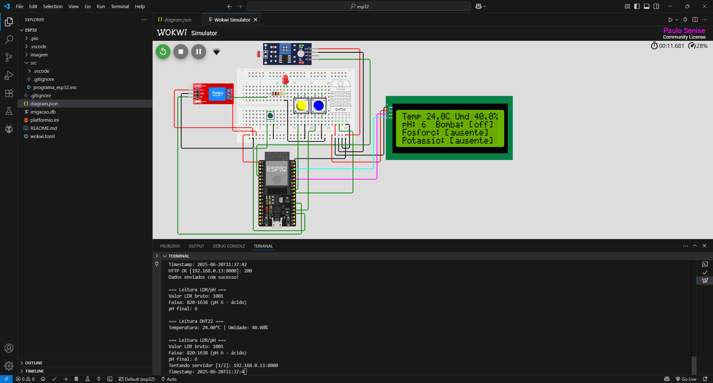
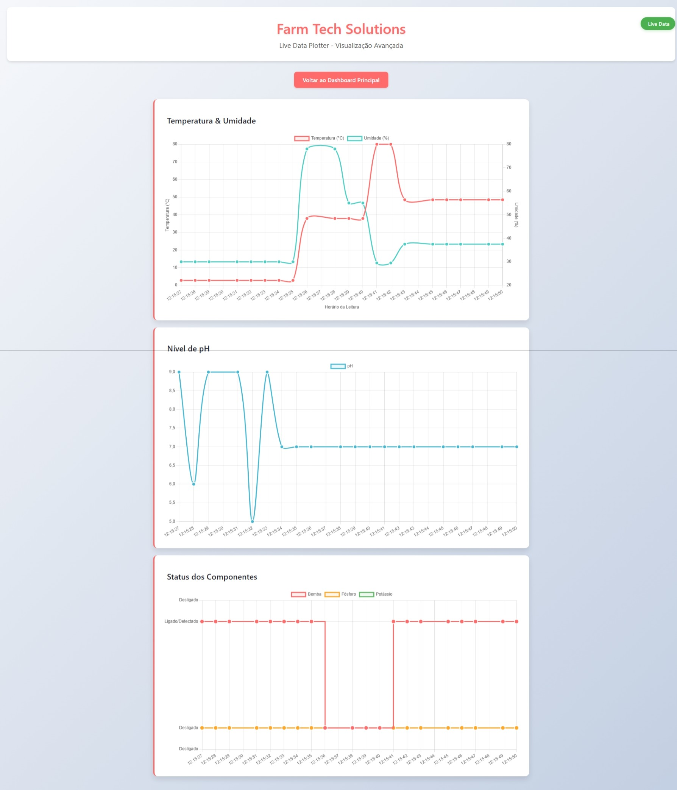

# Sistema de Irrigação Inteligente com ESP32  
### Projeto Fase 4 – FarmTech Solutions | FIAP

Este documento descreve o firmware do ESP32 utilizado na Fase 4 do projeto FarmTech Solutions. O sistema, simulado no Wokwi, é responsável por coletar dados de sensores, exibi-los em um display LCD e enviá-los via HTTP para um servidor local.

A principal melhoria nesta fase é a integração com um **display LCD I2C**, que oferece um monitoramento local claro e direto dos dados dos sensores e do status do sistema.

---

## Índice

- [Grupo](#grupo)
- [Visão Geral](#visão-geral-do-projeto)
- [Componentes](#componentes-utilizados)
- [Conexões](#conexões)
- [Lógica de Controle](#lógica-de-controle-da-bomba-de-irrigação)
- [Código](#código-cc)
- [Otimizações de Memória](#-otimizações-de-memória)

---

## Grupo

**Grupo 56 – FIAP**  
*Integrantes:*
- Felipe Sabino da Silva  
- Juan Felipe Voltolini  
- Luiz Henrique Ribeiro de Oliveira  
- Marco Aurélio Eberhardt Assimpção  
- Paulo Henrique Senise  

*Professores:*  
- Tutor: Leonardo Ruiz Orabona  
- Coordenador: André Godoi

---

## Visão Geral do Projeto

O sistema realiza as seguintes tarefas:
- Leitura contínua da **umidade do solo** e **temperatura**.
- Simulação de leitura de **pH**, **fósforo** e **potássio**.
- Acionamento automático de um relé (representando a bomba) com base na umidade.
- Exibição de todos os dados em tempo real em um **display LCD I2C 16x2**.
- Envio dos dados via **HTTP GET** para um servidor Flask para armazenamento e análise.
- Monitoramento em tempo real das variáveis através do **Serial Plotter** do Wokwi.

---

## Componentes Utilizados

| Componente               | Função                                           |
|--------------------------|--------------------------------------------------|
| **ESP32**                | Microcontrolador principal                       |
| **Sensor de Umidade**    | Mede a umidade do solo                           |
| **Sensor de Temperatura**| Mede a temperatura do solo                       |
| **Potenciômetro**        | Simula a leitura do sensor de pH                 |
| **Botões (2)**           | Simulam a detecção de Fósforo e Potássio         |
| **Botão Verde**          | Desliga a bomba manualmente                      |
| **Display LCD 16x2 I2C** | Exibe os dados dos sensores localmente           |
| **LED Vermelho**         | Simula o relé de acionamento da bomba de água    |

---

## Imagens do Projeto

- **Simulação no Wokwi com o Display LCD em funcionamento:**
  

- **Monitoramento via Serial Plotter:**
  

---

## Conexões

| Componente            | Pino do ESP32  |
|-----------------------|----------------|
| Sensor de Umidade     | Pino 34 (ADC)  |
| Sensor de Temperatura | Pino 35 (ADC)  |
| Sensor de pH (Pot)    | Pino 32 (ADC)  |
| Botão Fósforo (P)     | Pino 2         |
| Botão Potássio (K)    | Pino 18        |
| Relé (LED)            | Pino 4         |
| Display LCD (I2C)     | SDA (Pino 21), SCL (Pino 22) |

---

## Lógica de Controle da Bomba de Irrigação

A lógica de controle da bomba (simulada pelo LED vermelho) é simples e direta:

- **Se** a `umidade` for menor que 40% → **Liga** a bomba.
- **Se** a `umidade` for maior ou igual a 40% → **Desliga** a bomba.

O status da bomba (`on` ou `off`) é enviado para o servidor juntamente com os outros dados dos sensores.

---

## Código C/C++

O código-fonte do firmware está localizado em:

  [Código do ESP32 – programa_esp32.ino](./src/programa_esp32.ino)

O código é responsável por toda a lógica de leitura, controle e comunicação.

---

## Otimizações de Memória

O código foi otimizado para maximizar a eficiência de memória no ESP32, garantindo melhor performance e estabilidade do sistema.

### **Principais Otimizações Implementadas:**

#### **1. Tipos de Dados Otimizados**
```cpp
// Uso de tipos de dados com tamanho específico para economizar memória
uint8_t buttonPState = digitalRead(BUTTON_FOSFORO);
uint16_t ldrValue = 0;
```

#### **2. Constantes e Macros**
```cpp
// #define é usado para constantes para evitar o uso de RAM
#define LDR_PIN 34
const uint16_t INTERVALO_LEITURA = 2000;
```

#### **3. Otimização de Strings**
```cpp
// Strings constantes para reduzir o uso de memória heap
const char* STR_PRESENTE = "presente";
const char* STR_AUSENTE = "ausente";

// Uso de snprintf para formatação de strings, que é mais seguro e eficiente que concatenação
char urlBuffer[256];
snprintf(urlBuffer, sizeof(urlBuffer), 
         "http://SEU_IP_LOCAL:8000/data?umidade=%.1f&temperatura=%.1f...",
         h, t);
```

#### **4. Atualização Inteligente do Display**
```cpp
// O display LCD só é atualizado se os valores dos sensores realmente mudarem,
// evitando o redesenho constante da tela e economizando ciclos de processamento.
static float t_anterior = -999;
if (abs(t - t_anterior) > 0.1) {
  // Atualiza o display...
}
```

#### **5. Timeout e Reutilização de Conexão**
```cpp
// Timeout para a conexão Wi-Fi para evitar travamentos
uint8_t tentativasWiFi = 0;
while (WiFi.status() != WL_CONNECTED && tentativasWiFi < 20) {
  delay(500);
  tentativasWiFi++;
}

// Reutilização do cliente HTTP para diminuir a sobrecarga de criar novas conexões
static WiFiClient httpClient;
static HTTPClient http;
```


